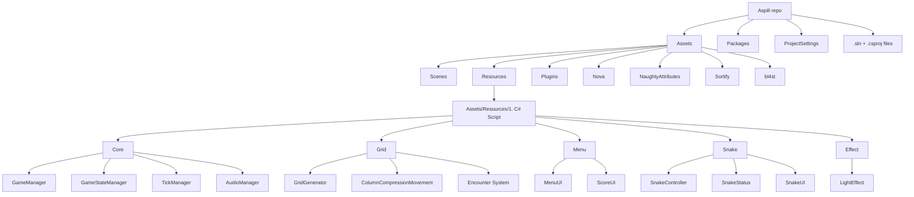

# Aspull

## Overview
Aspull is a Unity-based 2D snake survival game prototype. The player controls a snake across a tile grid while the map shifts, encounters trigger corridor distortions, and hazards such as walls and "death" zone. There are also the classic apple and the additional poison which upon consumption affected the snake's length.

<table>
  <tr>
    <td></td>
    <td></td>
    <td></td>
  </tr>
</table>

I developed this game independently over the course of seven days as part of a university assignment. The goal was to create a simple, fast-paced arcade game inspired by a console interface. At the time, I was also interested in exploring C programming, so I used the project as an opportunity to experiment with a console-inspired presentation while focusing on fast and responsive gameplay.

## Features
- Grid-based snake movement with directional buffering and collision handling
- Procedural encounter system with multiple pattern types such as WaveTunnel, SpiralDrift, PinchPoint, and Whirlpool
- Dynamic difficulty scaling and encounter state notifications
- Column-compression gameplay where walls and other entities shift downward over time
- Apple and poison pickups that change health and growth/shrink behavior
- HUD and score tracking with elapsed time, snake length, health, FPS, and high-score persistence
- Menu flow, countdown, and game-over transitions
- Audio system for background music and SFX

## Project structure

## Important systems and architecture
- Game state flow is controlled by GameStateManager, which tracks Boot, Menu, Running, and GameOver states and reloads the active scene on loss.
- TickManager drives the main gameplay loop by firing snake movement and column-compression ticks when the game is active.
- GridGenerator owns the tile map and visual grid, tracks tile types like Empty, Wall, Apple, Poison, SnakeHead, SnakeBody, and SnakeTail, and exposes grid conversion helpers.
- SnakeController is the central movement controller. It handles input, queued directions, movement validation, growth/shrink, stuck-prevention logic, and pickup consumption.
- ColumnCompressionMovement manages falling entities and pushes walls/obstacles down through the board while checking for collisions with the snake.
- EncounterGenerator and the EncounterSystem namespace build procedural corridor distortions. PatternLibrary maps encounter types to pattern implementations used during runtime.
- UI and game feedback are split across MenuUI, ScoreUI, and SnakeUI. ScoreUI also stores and reads a persisted high score via PlayerPrefs.

## Development notes
- This is a Unity project configured with standard Unity packages and editor tooling, including URP, Input System, and UI-related libraries.
- The main gameplay scene is under Assets/Scenes/Game Scene.unity.
- The repository includes third-party/editor assets under Assets/Nova, Assets/NaughtyAttributes, Assets/Sortify, and Assets/bl4st.
- Most runtime scripts are singleton-based and use runtime object lookup when serialized references are not assigned.
